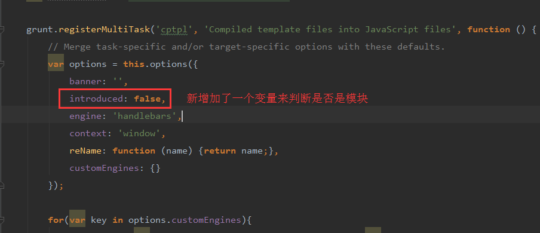
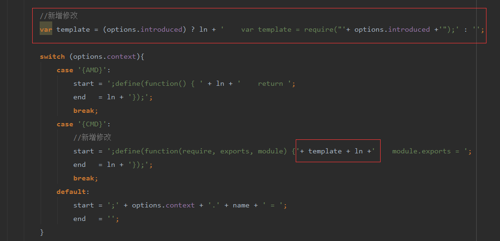

## grunt-基于多页面构建前端工作流

> * grunt + artTemplate + requireJs

#### 项目目录结构
```
- website
  - app                #代码开发目录
    - Static           #静态资源目录
      + images         #图片资源 
      + less           #less目录，按照通用、第三方、页面（模块）三个级别进行组织
      - script         #js脚本，按照components、lib、page进行组织
        + components
        + lib
        + page 
    - template         #针对view目录拆分的对应模块         
    + view             #HTML模板
  - dist               #grunt编译打包输出目录，无需建立目录可由grunt根据配置自动生成
    - Static
      + css
      + images
      + script                  
    + view
  + node_modules       #所使用的nodejs模块
  + doc                #文档说明
  package.json         #项目配置
  Gruntfile.js         #grunt配置
  README.md            #项目说明
```

#### 拉取node包
````javascript
$ npm install 
````

#### 初始化
````javascript
$ npm build
````

#### 开发者调试
````javascript
$ npm dev
````

#### 线上模式
````javascript
$ npm prod
````

### 相关点
- 基于LESS的CSS模块化构建方案（暂未包含雪碧图的自动构建功能在内）
- 利用RequireJs创建JS模块化
- artTemplate模板引擎

### 备注
利用`grunt-contrib-requirejs`打包入口文件时，由于`cptpl`在生成template时由于没有引进template包。在查看页面时，发渲染有一定的问题。这时候可直接在页面引入template相关JS文件。就可解决这个问题。
或者你也可以跟我一样。修改`cptpl`配置文件来解决问题。

